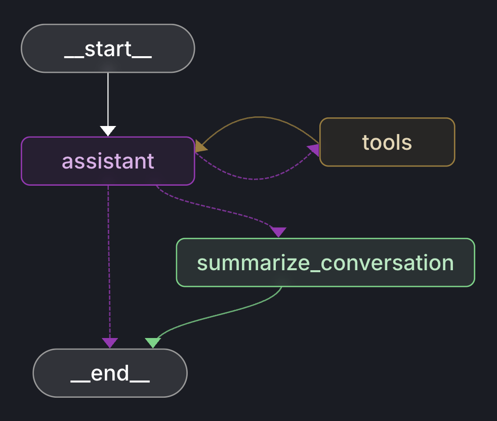

# Short-Term Memory Optimization
[](https://github.com/langchain-ai/langgraph)
[](https://python.org)
[](https://openai.com)
[](LICENSE)
[](CONTRIBUTING.md)
[]()

> This project demonstrates an effective memory optimization strategy that handles growing chat histories through automatic summarization, reducing token costs by up to 80% while maintaining conversational context.

## Features

- **Short-Term Memory**: Maintains conversation context within the current session using LangGraph's `checkpointer`, allowing the agent to reference previous messages and provide coherent responses throughout the interaction.
- **Web Search**: Integrates real-time web search capabilities through Tavily API to fetch current information and answer questions requiring up-to-date data.
- **Memory Optimizer**: Automatically summarizes conversation history when it exceeds optimal token limits, reducing API costs by up to 80% while preserving essential context.

## Table of Contents

- [About](#about)
- [Workflow Diagram](#workflow-diagram)
- [State](#state)
- [Nodes](#nodes)
  - [Assistant](#assistant)
  - [Tools](#tools)
  - [Summarize Conversation](#summarize-conversation)
- [Getting Started](#getting-started)
  - [Prerequisites](#prerequisites)
  - [Installation](#installation)
  - [Configuration](#configuration)
- [Usage](#usage)
- [Contributing](#contributing)
- [License](#license)
- [Contact](#contact)
- [Acknowledgments](#acknowledgments)
---
## About

When we deploy conversational agents in production, we soon face a significant challenge: exponential growth in input tokens! This challenge creates three critical problems. First, LLM models have strict context window limitations that restrict the size of input they can process. Second, LLM models lose context and perform poorly when fed with excessively long inputs, experiencing the "lost-in-the-middle" effect where important information gets overlooked. Finally, our API costs increase dramatically as token usage scales quadratically with input length. 

This project simple yet effective solution to this challenge through intelligent conversation summarization that automatically compresses chat history when it approaches token limits, reducing costs by up to 80% while preserving essential context and maintaining high-quality responses throughout extended interactions.

---
## Workflow Diagram




This diagram illustrates a ReAct (Reasoning and Acting) agent with the capability to automatically summarize conversation history when it exceeds optimal token limits.
## State

The state includes a list of messages between the assistant and human, plus a summary of previous interactions. The messages field uses the add_messages reducer to append new messages instead of overriding them. Below is an example of the state object:

```python
class State(TypedDict):
    """
    State schema for the conversational agent workflow.

    Attributes:
        messages: List of conversation messages with automatic message handling
        summary: Optional cumulative summary of the conversation history
    """
    messages: Annotated[list[AnyMessage], add_messages]
    summary: Optional[str]
```

## Nodes

Each node in the graph is responsible for a specific task. Below are the three main nodes and their responsibilities:

### Assistant
The main conversational node that processes user messages and generates responses using the LLM with tool-calling capabilities.

**Reads:**
- `messages`: Current conversation history
- `summary`: Previous conversation summary (if available)

**Writes:**
- `messages`: Appends the LLM response (or tool calls) to the conversation

### Tools
Executes web search operations when the assistant requests current information from the internet.

**Reads:**
- `messages`: Tool call requests from the assistant

**Writes:**
- `messages`: Appends tool execution results back to the conversation

### Summarize Conversation
Compresses lengthy conversation history into a concise summary when token limits are approached.

**Reads:**
- `messages`: Full conversation history to be summarized

**Writes:**
- `summary`: Updated conversation summary
- `messages`: Remove chat history except last 2 messages (keeping context while reducing tokens)


---
## Getting Started

These instructions will get you a copy of the project up and running on your local machine.

### Prerequisites

- Python 3.11 or higher
- OpenAI API Key
- Tavily API Key (for web search functionality)


### Installation

Clone the repository:

```bash
git clone https://github.com/PeymanKh/agent-memory-optimization.git
cd agent-memory-optimization
```

Install the required dependencies:

```bash
pip install -r requirements.txt
```

### Configuration

This LangGraph application uses a robust Pydantic-based configuration system with environment variable validation and cloud deployment support.

### Setup Environment Variables

1. **Copy the example configuration:**
   ```bash
   cp .env.example .env
   ```

2. **Edit the `.env` file with your actual values:**
   ```bash
   # OpenAI Configuration
   OPENAI_API_KEY=sk-your-openai-api-key-here
   MODEL_NAME=gpt-4
   
   # Tavily Search Configuration
   TAVILY_API_KEY=your-tavily-api-key-here
   
   # Environment
   ENVIRONMENT=development
    ```

### Configuration Structure

The system automatically validates and loads configuration using Pydantic:


```python
from src.config import config

# Access configuration values
print(f"Model: {config.llm.model_name}")
print(f"Environment: {config.environment}")

# Check environment
if config.is_production():
    # Production settings
    pass
elif config.is_development():
    # Development settings  
    pass
```


---
## Usage

Run the conversational agent:

```bash
  python main.py
```
---

## Contributing

I welcome contributions! Please:
1. Fork the repository
2. Create a feature branch (git checkout -b feature/new-feature)
3. Commit your changes (git commit -m 'Add news feature')
4. Push to the branch (git push origin feature/new-feature)
5. Open a pull request

---
## License

This project is licensed under the MIT License - see the [LICENSE.md](LICENSE) file for details.


---
## Contact

- **Project Link:** [https://github.com/PeymanKh/agent-memory-optimization.git](https://github.com/PeymanKh/agent-memory-optimization.git)
- **Author's Website:** [peymankh.dev](https://peymankh.dev)
- **Author's Email:** [peymankhodabandehlouei@gmail.com](mailto:peymankhodabandehlouei@gmail.com)

---
## Acknowledgments

- [LangChain](https://python.langchain.com/docs/introduction) for the foundational framework
- [LangGraph](https://python.langchain.com/docs/introduction) for workflow orchestration
- [Tavily](https://www.tavily.com) for web search capabilities
- [OpenAI](https://platform.openai.com/docs/overview) for language model access

